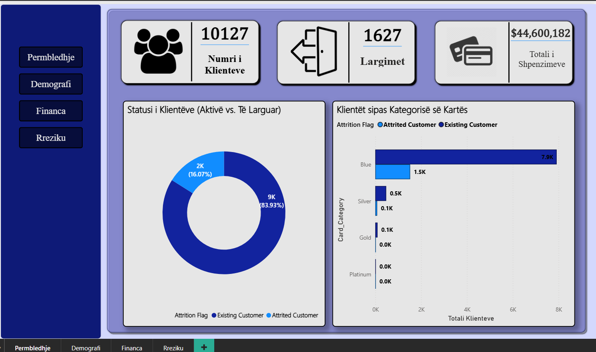
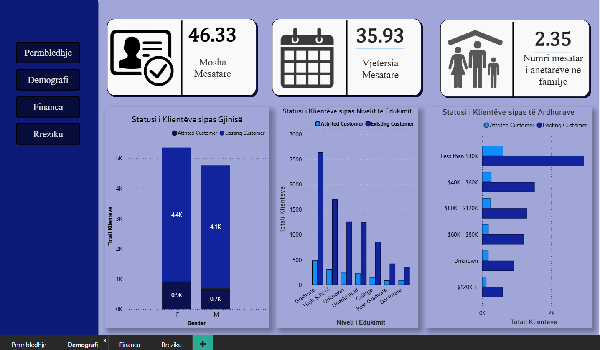
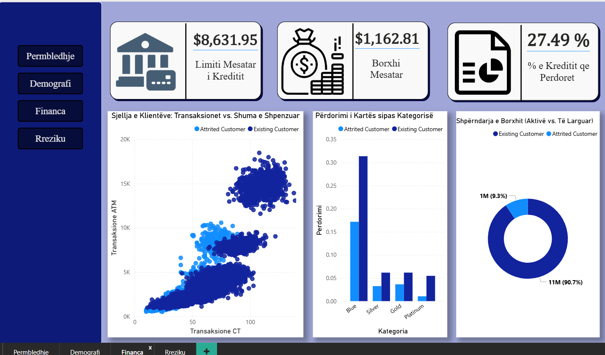
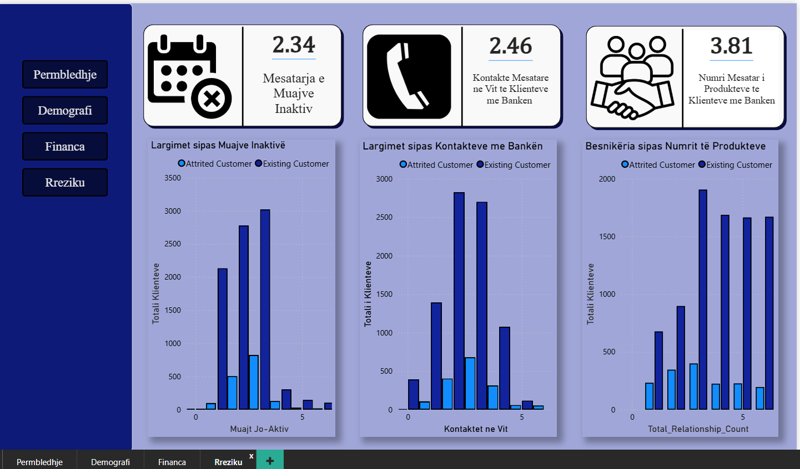

# 📊 Bank Customer Churn & Risk Analysis Dashboard

## 📝 Project Overview
This project is an end-to-end Data Analysis and Business Intelligence dashboard built in **Power BI**. The primary objective is to analyze credit card customer data to understand behavior patterns, demographic distributions, financial habits, and most importantly, identify the key "Red Flags" that lead to customer churn (attrition).

By segmenting active customers versus attrited (churned) customers, this dashboard provides actionable insights for bank executives and retention teams to proactively minimize customer loss.

---

## 🚀 The Business Problem
Customer acquisition is highly expensive for financial institutions. Losing existing credit card clients impacts the bank's revenue directly. The bank needed a visual tool to answer critical questions:
* What is the current churn rate?
* Are there specific demographic groups more prone to leaving?
* How does transaction volume and credit utilization impact loyalty?
* What are the early warning signs (risk factors) before a customer closes their account?

---

## 📑 Dashboard Structure (Pages)

The report is divided into four highly focused sections to ensure a seamless analytical flow:

### 1. Overview (Përmbledhje)
Provides a high-level summary of the bank's current standing. 
* **KPIs:** Total Customers, Total Churned, Total Transaction Amount.
* **Visuals:** Shows the overall attrition rate (~16%) and customer distribution across card categories (Blue, Silver, Gold, Platinum).

### 2. Demographics (Demografi)
Analyzes *who* the customers are.
* **KPIs:** Average Age, Average Tenure (Months), Average Dependents.
* **Visuals:** Breakdown of customer churn by Gender, Education Level, and Income Category.

### 3. Finance (Financa)
Deep dives into the monetary habits of the portfolio.
* **KPIs:** Average Credit Limit, Average Revolving Balance, Average Utilization Ratio.
* **Visuals:** A detailed Scatter Plot showing the direct correlation between Transaction Count and Transaction Amount, clearly clustering the behavior of churned vs. existing customers.

### 4. Risk Analysis (Rreziku)
The predictive heart of the dashboard, identifying "Red Flags" for retention.
* **KPIs:** Average Inactive Months, Average Contacts (Calls) in the last 12 months, Average Product Count.
* **Visuals:** Identifies the critical breaking points (e.g., customers dropping off after 3-4 contacts with the bank or 3+ months of inactivity).

---

## 💡 Key Insights & Findings
Through this dashboard, several critical business insights were uncovered:
1. **The 16% Churn Rate:** Out of 10,127 customers, 1,627 have left the bank, representing a ~16% attrition rate.
2. **The "Contact" Red Flag:** Customers who contact the bank 3 or more times in a year show a drastically higher churn probability, indicating unresolved issues or dissatisfaction.
3. **Inactivity Precedes Churn:** A spike in account closures is visible when customers remain inactive for 2 to 3 months.
4. **Low Engagement = High Risk:** The scatter plot in the Finance section clearly shows that attrited customers cluster tightly in the low-transaction count / low-transaction amount quadrant. 
5. **Product Loyalty:** Customers holding 3 or more products (loans, credit cards, accounts) are significantly more loyal than those holding just 1 or 2 products.

---

## 🛠️ Tools & Technologies Used
* **Power BI:** Data visualization, interactive dashboard creation, and UI/UX design.
* **DAX (Data Analysis Expressions):** Used to create custom Measures, calculate averages, and aggregate financial data.
* **Power Query:** Data cleaning, formatting, and preparation.
* **Canva / Figma:** Custom background design and UI asset generation.

---

## Download Power BI File 

[**Download**](https://github.com/ermirhaxhia/credit-card-power-bi-dashboard/raw/main/Credit-Card-Costumers.pbix)

---

## 👤 Author

**Ermir Haxhia** — Applied Mathematics · Data Analysis · Programming  
🌐 [Portfolio](https://ermir-haxhia.vercel.app) · [LinkedIn](https://www.linkedin.com/in/ermir-haxhia-b988212b5) · [GitHub](https://github.com/ermirhaxhia)

If you find this project interesting or have any feedback, feel free to reach out!